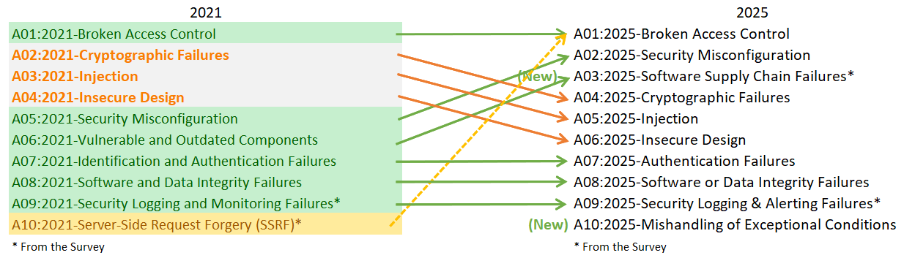

# 十大最关键的 Web 应用程序安全风险

# 简介

欢迎使用 OWASP Top Ten 的第 8 版！

衷心感谢所有在调查中贡献数据和观点的人。没有你们，这一版将不可能完成。**谢谢你们！**

## OWASP Top 10:2025 介绍

* [A01:2025 - 失效的访问控制（Broken Access Control）](A01_2025-Broken_Access_Control.md)
* [A02:2025 - 安全配置错误（Security Misconfiguration）](A02_2025-Security_Misconfiguration.md)
* [A03:2025 - 软件供应链失效（Software Supply Chain Failures）](A03_2025-Software_Supply_Chain_Failures.md)
* [A04:2025 - 加密机制失效（Cryptographic Failures）](A04_2025-Cryptographic_Failures.md)
* [A05:2025 - 注入（Injection）](A05_2025-Injection.md)
* [A06:2025 - 不安全的设计（Insecure Design）](A06_2025-Insecure_Design.md)
* [A07:2025 - 身份认证失效（Authentication Failures）](A07_2025-Authentication_Failures.md)
* [A08:2025 - 软件和数据完整性失效（Software or Data Integrity Failures）](A08_2025-Software_or_Data_Integrity_Failures.md)
* [A09:2025 - 安全日志与告警失效（Security Logging & Alerting Failures）](A09_2025-Security_Logging_and_Alerting_Failures.md)
* [A10:2025 - 异常情况处理不当（Mishandling of Exceptional Conditions）](A10_2025-Mishandling_of_Exceptional_Conditions.md)

## 2025 年 Top 10 的变化

2025 年的 Top Ten 有两个新类别和一个合并类别。我们尽可能保持对根本原因而非症状的关注。鉴于软件工程和软件安全的复杂性，创建十个类别而不产生一定程度的重叠基本上是不可能的。

* **[A01:2025 - 失效的访问控制（Broken Access Control）](A01_2025-Broken_Access_Control.md)** 保持第 1 位的位置，作为最严重的应用程序安全风险；贡献的数据表明，平均有 3.73% 的受测应用程序存在该类别中 40 个通用缺陷枚举（CWEs）中的一个或多个。如上图中的虚线所示，服务器端请求伪造（SSRF）已并入此类别。
* **[A02:2025 - 安全配置错误（Security Misconfiguration）](A02_2025-Security_Misconfiguration.md)** 从 2021 年的第 5 位上升到 2025 年的第 2 位。本轮数据中的配置错误更为普遍。3.00% 的受测应用程序存在该类别中 16 个 CWEs 中的一个或多个。这并不令人惊讶，因为软件工程正在持续增加基于配置的应用程序行为数量。
* **[A03:2025 - 软件供应链失效（Software Supply Chain Failures）](A03_2025-Software_Supply_Chain_Failures.md)** 是对 [A06:2021-易受攻击和过时的组件](https://owasp.org/Top10/A06_2021-Vulnerable_and_Outdated_Components/) 的扩展，涵盖了更广泛的范围，包括在整个软件依赖项、构建系统和分发基础设施生态系统内或跨系统发生的妥协。该类别在社区调查中被压倒性地投票选为首要关注点。该类别有 5 个 CWEs，在收集的数据中存在感有限，但我们认为这是由于测试方面的挑战，并希望测试能在此领域跟上。该类别在数据中出现次数最少，但来自 CVEs 的平均利用率和影响分数最高。
* **[A04:2025 - 加密机制失效（Cryptographic Failures）](A04_2025-Cryptographic_Failures.md)** 排名下降两位，从第 2 位降至第 4 位。贡献的数据表明，平均有 3.80% 的应用程序存在该类别中 32 个 CWEs 中的一个或多个。该类别通常会导致敏感数据泄露或系统被入侵。
* **[A05:2025 - 注入（Injection）](A05_2025-Injection.md)** 排名下降两位，从第 3 位降至第 5 位，相对于加密机制失效和不安全的设计保持其位置。注入是被测试最多的类别之一，与该类别中 38 个 CWEs 相关的 CVEs 数量最多。注入涵盖了一系列问题，从跨站脚本（高频率/低影响）到 SQL 注入（低频率/高影响）漏洞。
* **[A06:2025 - 不安全的设计（Insecure Design）](A06_2025-Insecure_Design.md)** 下滑两位，从第 4 位降至第 6 位，因为安全配置错误和软件供应链失效超越了它。该类别于 2021 年引入，我们已经看到行业在威胁建模方面有了显著改进，并且更加重视安全设计。
* **[A07:2025 - 身份认证失效（Authentication Failures）](A07_2025-Authentication_Failures.md)** 保持在第 7 位，名称略有变化（之前为"[识别和身份认证失效](https://owasp.org/Top10/A07_2021-Identification_and_Authentication_Failures/)"），以更准确地反映该类别中的 36 个 CWEs。该类别仍然很重要，但标准化身份认证框架的增加使用似乎对身份认证失效的发生产生了有益影响。
* **[A08:2025 - 软件和数据完整性失效（Software or Data Integrity Failures）](A08_2025-Software_or_Data_Integrity_Failures.md)** 继续保持在列表中的第 8 位。该类别侧重于未能维护信任边界和验证软件、代码和数据工件的完整性，其层面低于软件供应链失效。
* **[A09:2025 - 安全日志与告警失效（Security Logging & Alerting Failures）](A09_2025-Security_Logging_and_Alerting_Failures.md)** 保持在第 9 位。该类别名称略有变化（之前为 [安全日志和监控失效](https://owasp.org/Top10/A09_2021-Security_Logging_and_Monitoring_Failures/)"），以强调告警功能的重要性，该功能需要对相关日志事件采取适当的行动。没有告警的出色日志在识别安全事件方面价值甚微。该类别在数据中总是被低估的，并且再次由社区调查参与者投票进入列表中的位置。
* **[A10:2025 - 异常情况处理不当（Mishandling of Exceptional Conditions）](A10_2025-Mishandling_of_Exceptional_Conditions.md)** 是 2025 年的新类别。该类别包含 24 个 CWEs，重点关注不当的错误处理、逻辑错误、失效开放（failing open）以及系统可能遇到的其他异常情况引发的相关场景。

## 方法论

本版 Top Ten 仍然以数据为依据，但并非盲目地数据驱动。我们根据贡献的数据对 12 个类别进行了排名，并允许社区调查的反馈提升或突出其中两个。我们这样做有一个根本原因：检查贡献的数据本质上是在回顾过去。应用程序安全研究人员致力于识别新漏洞和开发新的测试方法。将这些测试集成到工具和流程中需要数周到数年的时间。当我们能够大规模可靠地测试某个弱点时，可能已经过去了数年。还有一些重要的风险可能永远无法可靠地测试并呈现在数据中。为了平衡这种视角，我们使用社区调查来询问一线的应用程序安全和开发从业者，他们认为哪些基本风险可能在测试数据中被低估了。

## 类别结构说明

与上一版 OWASP Top Ten 相比，一些类别发生了变化。以下是类别变更的高层摘要。

在本次迭代中，我们请求数据，没有像 2021 版那样对 CWEs 进行限制。我们要求提供给定年份（从 2021 年开始）测试的应用程序数量，以及测试中发现至少一个 CWE 实例的应用程序数量。这种格式使我们能够跟踪每个 CWE 在应用程序群体中的普遍程度。我们出于目的忽略频率；虽然频率在其他情况下可能是必要的，但它只会掩盖应用程序群体中的实际普遍性。一个应用程序有 4 个 CWE 实例还是 4,000 个实例，都不属于 Top Ten 的计算范围。特别是手动测试人员倾向于无论漏洞在应用程序中重复多少次都只列出一次，而自动化测试框架将每个漏洞实例列为唯一的。我们从 2017 年的大约 30 个 CWEs，到 2021 年的近 400 个 CWEs，再到本版数据集中需要分析的 589 个 CWEs。我们计划在未来进行额外的数据分析作为补充。CWEs 数量的显著增加 necessitates（ necessitates 意味着"需要"）对类别结构进行更改。

我们花了数月时间对 CWEs 进行分组和分类，本可以继续数月。我们不得不在某个时候停止。CWEs 既有根本原因类型，也有症状类型，根本原因类型如"加密机制失效"和"配置错误"，症状类型如"敏感数据泄露"和"拒绝服务"。我们决定尽可能关注根本原因，因为这对于提供识别和修复指导更为合理。关注根本原因而非症状并非新概念；Top Ten 一直是症状和根本原因的混合体。CWEs 也是症状和根本原因的混合体；我们只是更加刻意地指出这一点。本版每个类别平均有 25 个 CWEs，下限为 A03:2025-软件供应链失效和 A09:2025-安全日志与告警失效的 5 个 CWEs，上限为 A01:2025-失效的访问控制的 40 个 CWEs。我们决定将每个类别的 CWEs 数量上限设为 40。这种更新的类别结构提供了额外的培训优势，因为公司可以专注于对特定语言/框架有意义的 CWEs。

有人问过我们为什么不转向 10 个 CWEs 的列表作为 Top 10，类似于 MITRE 前 25 个最危险的软件弱点。我们在类别中使用多个 CWEs 有两个主要原因。首先，并非所有 CWEs 都存在于所有编程语言或框架中。这会导致工具和培训/认知计划出现问题，因为 Top Ten 的一部分可能不适用。第二个原因是，常见漏洞有多个 CWEs。例如，一般注入、命令注入、跨站脚本、硬编码密码、缺乏验证、缓冲区溢出、敏感信息明文存储等都有多个 CWEs。根据组织或测试人员的不同，可能会使用不同的 CWEs。通过使用包含多个 CWEs 的类别，我们可以帮助提高基线，并提高对可能在通用类别名称下发生的不同类型弱点的认知。在 2025 版 Top Ten 中，10 个类别中共有 248 个 CWEs。在发布时，[MITRE 可下载字典](https://cwe.mitre.org) 中共有 968 个 CWEs。

## 数据如何用于选择类别

类似于我们为 2021 版所做的，我们利用 CVE 数据来评估 *可利用性（Exploitability）* 和 *（技术性）影响（Impact）*。我们下载了 OWASP Dependency Check 并提取了 CVSS 利用和影响分数，按 CVEs 中列出的相关 CWEs 进行分组。这花费了大量的研究和精力，因为所有 CVEs 都有 CVSSv2 分数，但 CVSSv2 存在 CVSSv3 应该解决的缺陷。在某个时间点之后，所有 CVEs 也会被分配 CVSSv3 分数。此外，评分范围和公式在 CVSSv2 和 CVSSv3 之间进行了更新。

在 CVSSv2 中，利用性和（技术性）影响都可以高达 10.0，但公式会将它们分别降低到 60%（利用性）和 40%（影响）。在 CVSSv3 中，理论最大值被限制为利用性 6.0 和影响 4.0。考虑到权重，影响评分在 CVSSv3 中平均提高了近 1.5 分，而可利用性平均降低了近 0.5 分。

在国家漏洞数据库（NVD）中，大约有 175k 条（高于 2021 年的 125k）CVEs 映射到 CWEs 的记录，从 OWASP Dependency Check 中提取。此外，有 643 个唯一的 CWEs 映射到 CVEs（高于 2021 年的 241 个）。在近 220k 个提取的 CVEs 中，160k 有 CVSS v2 分数，156k 有 CVSS v3 分数，6k 有 CVSS v4 分数。许多 CVEs 有多个分数，这就是为什么总数超过 220k。

对于 2025 版 Top Ten，我们按以下方式计算平均利用和影响分数。我们将所有具有 CVSS 分数的 CVEs 按 CWE 分组，并根据具有 CVSSv3 的人口百分比以及具有 CVSSv2 分数的剩余人口，对利用和影响分数进行加权，以获得总体平均值。我们将这些平均值映射到数据集中的 CWEs，用作风险方程另一半的利用性和（技术性）影响评分。

你可能会问，为什么不使用 CVSS v4.0？这是因为评分算法发生了根本性变化，它不再像 CVSS v2 和 CVSSv3 那样容易提供 *利用性* 或 *影响* 分数。我们将尝试找到一种方法，在未来的 Top Ten 版本中使用 CVSS v4.0 评分，但我们无法在 2025 版中及时确定如何做到这一点。

## 为什么使用社区调查

数据中的结果在很大程度上局限于行业能够以自动化方式测试的内容。与一位经验丰富的 AppSec 专业人士交谈，他们会告诉你他们发现的东西和看到的趋势，而这些尚未出现在数据中。人们需要时间来开发某些漏洞类型的测试方法，然后需要更多时间将这些测试自动化并针对大量应用程序运行。我们发现的一切都是在回顾过去，可能会遗漏去年尚未出现在数据中的趋势。

因此，我们只从数据中选择十个类别中的八个，因为数据是不完整的。另外两个类别来自 Top 10 社区调查。它允许一线从业者投票选出他们认为最高的风险，这些风险可能不在数据中（也可能永远不会在数据中体现）。

## 感谢我们的数据贡献者

以下组织（以及几位匿名捐赠者）慷慨捐赠了超过 280 万个应用程序的数据，使其成为最大、最全面的应用程序安全数据集。没有你们，这将不可能实现。

* Accenture (Prague)
* Anonymous (multiple)
* Bugcrowd
* Contrast Security
* CryptoNet Labs
* Intuitor SoftTech Services
* Orca Security
* Probely
* Semgrep
* Sonar
* usd AG
* Veracode
* Wallarm

## 主要作者
* Andrew van der Stock - X: [@vanderaj](https://x.com/vanderaj)
* Brian Glas - X: [@infosecdad](https://x.com/infosecdad)
* Neil Smithline - X: [@appsecneil](https://x.com/appsecneil)
* Tanya Janca - X: [@shehackspurple](https://x.com/shehackspurple)
* Torsten Gigler - Mastodon: [@torsten_gigler@infosec.exchange](https://infosec.exchange/@torsten_gigler)

## 记录问题和拉取请求

请记录任何更正或问题：

### 项目链接：
* [主页](https://owasp.org/www-project-top-ten/)
* [GitHub 仓库](https://github.com/OWASP/Top10)
