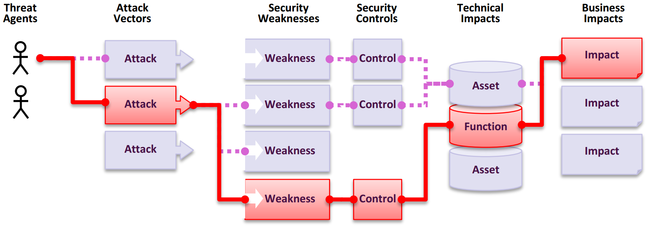

# 什么是应用程序安全风险？
攻击者可能通过许多不同的路径利用您的应用程序来对您的企业或组织造成伤害。每一条路径都构成一个潜在风险，需要加以调查。

<table>
  <tr>
   <td>
    <strong>威胁主体（Threat Agents）</strong>
   </td>
   <td>
    <strong>攻击 \
向量（Attack Vectors）</strong>
   </td>
   <td>
    <strong>可利用性（Exploitability）</strong>
   </td>
   <td>
    <strong>缺失安全控制的可能性（Likelihood of Missing Security）</strong>

    <strong>控制措施（Controls）</strong>
   </td>
   <td>
    <strong>技术性（Technical）</strong>

    <strong>影响（Impacts）</strong>
   </td>
   <td>
    <strong>业务性（Business）</strong>

    <strong>影响（Impacts）</strong>
   </td>
  </tr>
  <tr>
   <td>
    <strong>因环境而异， \
动态情境图</strong>
   </td>
   <td>
    <strong>按应用程序暴露面（按环境）</strong>
   </td>
   <td>
    <strong>平均加权可利用性</strong>
   </td>
   <td>
    <strong>缺失的控制措施 \
按平均发生率 \
按覆盖率加权</strong>
   </td>
   <td>
    <strong>平均加权影响</strong>
   </td>
   <td>
    <strong>按业务</strong>
   </td>
  </tr>
</table>

在我们的风险评级中，我们考虑了可利用性、某个弱点的安全控制措施缺失的平均可能性及其技术性影响的通用参数。

每个组织都是独特的，其威胁主体、目标以及任何违规的影响也是如此。如果一个公共利益组织使用内容管理系统（CMS）发布公共信息，而一个医疗系统使用完全相同的 CMS 来管理敏感的健康记录，那么对于同一软件，威胁主体和业务影响可能非常不同。基于应用程序的暴露面、按情境图（针对按业务和位置的定向和非定向攻击）适用的威胁主体以及个别业务影响，理解对您的组织的风险至关重要。

## 数据如何用于选择类别和排名

在 2017 年，我们按发生率选择类别以确定可能性，然后根据数十年的经验通过团队讨论按可利用性、可检测性（也是可能性）和技术性影响进行排名。对于 2021 年，我们使用国家漏洞数据库（NVD）中 CVSSv2 和 CVSSv3 分数的数据来评估可利用性和（技术性）影响。对于 2025 年，我们继续沿用 2021 年创建的方法论。

我们下载了 OWASP Dependency Check 并提取了按相关 CWEs 分组的 CVSS 利用性和影响分数。这花费了大量的研究和精力，因为所有 CVEs 都有 CVSSv2 分数，但 CVSSv2 存在 CVSSv3 应该解决的缺陷。在某个时间点之后，所有 CVEs 也会被分配 CVSSv3 分数。此外，评分范围和公式在 CVSSv2 和 CVSSv3 之间进行了更新。

在 CVSSv2 中，利用性（Exploit）和（技术性）影响（Impact）都可以高达 10.0，但公式会将它们分别降低到 60%（利用性）和 40%（影响）。在 CVSSv3 中，理论最大值被限制为利用性 6.0 和影响 4.0。考虑到权重，影响评分在 CVSSv3 中平均提高了近 1.5 分，而可利用性在我们进行 2021 年 Top Ten 分析时平均降低了近 0.5 分。

在国家漏洞数据库（NVD）中，大约有 175k 条（高于 2021 年的 125k）CVEs 映射到 CWEs 的记录，从 OWASP Dependency Check 中提取。此外，有 643 个唯一的 CWEs 映射到 CVEs（高于 2021 年的 241 个）。在近 220k 个提取的 CVEs 中，160k 有 CVSS v2 分数，156k 有 CVSS v3 分数，6k 有 CVSS v4 分数。许多 CVEs 有多个分数，这就是为什么总数超过 220k。

对于 2025 版 Top Ten，我们按以下方式计算平均利用和影响分数。我们将所有具有 CVSS 分数的 CVEs 按 CWE 分组，并根据具有 CVSSv3 的人口百分比以及具有 CVSSv2 分数的剩余人口，对利用和影响分数进行加权，以获得总体平均值。我们将这些平均值映射到数据集中的 CWEs，用作风险方程另一半的利用性（Exploit）和（技术性）影响（Impact）评分。

你可能会问，为什么不使用 CVSS v4.0？这是因为评分算法发生了根本性变化，它不再像 CVSS v2 和 CVSSv3 那样容易提供 *利用性* 或 *影响* 分数。我们将尝试找到一种方法，在未来的 Top Ten 版本中使用 CVSS v4.0 评分，但我们无法在 2025 版中及时确定如何做到这一点。

对于发生率，我们计算了某组织在一段时间内测试的应用程序群体中，易受每个 CWE 攻击的应用程序百分比。作为提醒，我们没有使用频率（或某个问题在应用程序中出现的次数），我们关注的是应用程序群体中有多少百分比被发现存在每个 CWE。

对于覆盖率，我们查看所有组织针对给定 CWE 测试的应用程序百分比。计算出的覆盖率越高，对发生率准确性的保证就越强，因为样本量更能代表总体。

我们为本迭代使用的公式与 2021 年类似，但有一些权重变化：
(最大发生率 % * 1000) + (最大覆盖率 % * 100) + (平均可利用性 * 10) + (平均影响 * 20) + (总发生次数 / 10000) = 风险评分

计算出的分数范围从失效访问控制类别的 621.60 到内存管理错误的 271.08。

这不是一个完美的系统，但它对于风险类别排名是有价值的。

一个日益增长的额外挑战是"应用程序"的定义。随着行业转向由微服务和其他比传统应用程序更小的实现组成的不同架构，计算变得更加困难。例如，如果一个组织正在测试代码仓库，它认为什么是应用程序？类似于 CVSSv4 的发展，下一版 Top Ten 可能需要调整分析和评分，以应对不断变化的行业。

## 数据因素

Top Ten 的每个类别都列出了数据因素，以下是它们的含义：

**映射的 CWEs（CWEs Mapped）：** Top Ten 团队映射到该类别的 CWEs 数量。

**发生率（Incidence Rate）：** 发生率是指某组织在该年度测试的应用程序群体中，易受该 CWE 攻击的应用程序百分比。

**加权可利用性（Weighted Exploit）：** 来自映射到 CWEs 的 CVEs 所分配的 CVSSv2 和 CVSSv3 分数中的可利用性子分数，经过归一化并置于 10 分制。

**加权影响（Weighted Impact）：** 来自映射到 CWEs 的 CVEs 所分配的 CVSSv2 和 CVSSv3 分数中的影响子分数，经过归一化并置于 10 分制。

**（测试）覆盖率（(Testing) Coverage）：** 所有组织针对给定 CWE 测试的应用程序百分比。

**总发生次数（Total Occurrences）：** 被发现存在映射到该类别的 CWEs 的应用程序总数。

**总 CVEs（Total CVEs）：** 国家漏洞数据库（NVD）中映射到映射到该类别的 CWEs 的 CVEs 总数。

**公式（Formula）：** (最大发生率 % * 1000) + (最大覆盖率 % * 100) + (平均可利用性 * 10) + (平均影响 * 20) + (总发生次数 / 10000) = 风险评分
