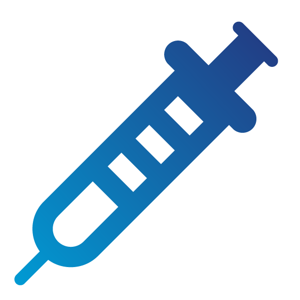

# A05:2025 注入（Injection） {: style="height:80px;width:80px" align="right"}

## 背景

注入从第3名下降两位至第5名，相对于A04:2025-加密失败和A06:2025-不安全设计保持其位置。注入是测试最多的类别之一，100%的应用程序都经过了某种形式的注入测试。它拥有所有类别中最多的CVE数量，该类别中有37个CWE。注入包括跨站脚本（高频率/低影响），拥有超过3万个CVE，以及SQL注入（低频率/高影响），拥有超过1.4万个CVE。CWE-79 在网页生成期间对输入的不当中和（'跨站脚本'）报告的大量CVE降低了该类别的平均加权影响。


## 评分表


<table>
  <tr>
   <td>映射的CWE数量
   </td>
   <td>最大发生率
   </td>
   <td>平均发生率
   </td>
   <td>最大覆盖率
   </td>
   <td>平均覆盖率
   </td>
   <td>平均加权利用难度
   </td>
   <td>平均加权影响
   </td>
   <td>总出现次数
   </td>
   <td>总CVE数量
   </td>
  </tr>
  <tr>
   <td>37
   </td>
   <td>13.77%
   </td>
   <td>3.08%
   </td>
   <td>100.00%
   </td>
   <td>42.93%
   </td>
   <td>7.15
   </td>
   <td>4.32
   </td>
   <td>1,404,249
   </td>
   <td>62,445
   </td>
  </tr>
</table>


## 描述

注入漏洞是一种应用程序缺陷，允许不受信任的用户输入被发送到解释器（例如浏览器、数据库、命令行），并导致解释器将该输入的一部分作为命令执行。

当以下情况发生时，应用程序容易受到攻击：

* 用户提供的数据未被应用程序验证、过滤或清理。
* 动态查询或非参数化调用在没有上下文感知转义的情况下直接在解释器中使用。
* 未经清理的数据在对象关系映射（ORM）搜索参数中使用，以提取额外的敏感记录。
* 潜在恶意数据被直接使用或拼接。SQL或命令在动态查询、命令或存储过程中包含结构和恶意数据。

一些更常见的注入类型包括SQL、NoSQL、OS命令、对象关系映射（ORM）、LDAP，以及表达式语言（EL）或对象图导航库（OGNL）注入。所有解释器中的概念都是相同的。检测最好通过源代码审查结合对所有参数、头、URL、cookie、JSON、SOAP和XML数据输入的自动化测试（包括模糊测试）来实现。将静态（SAST）、动态（DAST）和交互式（IAST）应用程序安全测试工具添加到CI/CD管道中，也有助于在生产部署之前识别注入缺陷。

一类相关的注入漏洞在LLM（大语言模型）中已变得常见。这些在[OWASP LLM Top 10](https://genai.owasp.org/llm-top-10/)中单独讨论，特别是[LLM01:2025 提示注入](https://genai.owasp.org/llmrisk/llm01-prompt-injection/)。


## 如何预防

预防注入的最佳方法是将数据与命令和查询分开：

* 首选方案是使用安全API，它完全避免使用解释器，提供参数化接口，或迁移到对象关系映射工具（ORM）。
**注意：**即使使用了参数化，如果PL/SQL或T-SQL拼接查询和数据，或使用EXECUTE IMMEDIATE或exec()执行恶意数据，存储过程仍可能引入SQL注入。

当无法将数据与命令分开时，您可以使用以下技术降低威胁。

* 使用积极的服务器端输入验证。这不是完整的防御，因为许多应用程序需要特殊字符，例如文本区域或移动应用程序的API。
* 对于任何剩余的动态查询，使用特定解释器的转义语法转义特殊字符。
**注意：**SQL结构（如表名、列名等）无法转义，因此用户提供的结构名称是危险的。这是报表编写软件中的常见问题。

**警告**这些技术涉及解析和转义复杂字符串，使其容易出错，并且在底层系统发生微小变化时不够健壮。

## 攻击场景示例

**场景 #1：** 应用程序在构造以下易受攻击的SQL调用时使用了不受信任的数据：

```
String query = "SELECT * FROM accounts WHERE custID='" + request.getParameter("id") + "'";
```

攻击者在其浏览器中修改'id'参数值以发送：`' OR '1'='1`。例如：

```
http://example.com/app/accountView?id=' OR '1'='1
```

这将改变查询的含义，返回accounts表中的所有记录。更危险的攻击可以修改或删除数据，甚至调用存储过程。

**场景 #2：** 应用程序对框架的盲目信任可能导致查询仍然存在漏洞。例如，Hibernate查询语言（HQL）：

```
Query HQLQuery = session.createQuery("FROM accounts WHERE custID='" + request.getParameter("id") + "'");
```

攻击者提供：`' OR custID IS NOT NULL OR custID='`。这将绕过过滤器并返回所有账户。虽然HQL比原始SQL具有更少危险函数，但当用户输入被拼接到查询中时，它仍然允许未经授权的数据访问。

**场景 #3：** 应用程序将用户输入直接传递给OS命令：

```
String cmd = "nslookup " + request.getParameter("domain");
Runtime.getRuntime().exec(cmd);
```

攻击者提供 `example.com; cat /etc/passwd` 以在服务器上执行任意命令。

## 参考资料

* [OWASP主动控制：安全数据库访问](https://owasp.org/www-project-proactive-controls/v3/en/c3-secure-database)
* [OWASP ASVS：V5 输入验证和编码](https://owasp.org/www-project-application-security-verification-standard)
* [OWASP测试指南：SQL注入、](https://owasp.org/www-project-web-security-testing-guide/latest/4-Web_Application_Security_Testing/07-Input_Validation_Testing/05-Testing_for_SQL_Injection) [命令注入](https://owasp.org/www-project-web-security-testing-guide/latest/4-Web_Application_Security_Testing/07-Input_Validation_Testing/12-Testing_for_Command_Injection)和[ORM注入](https://owasp.org/www-project-web-security-testing-guide/latest/4-Web_Application_Security_Testing/07-Input_Validation_Testing/05.7-Testing_for_ORM_Injection)
* [OWASP速查表：注入预防](https://cheatsheetseries.owasp.org/cheatsheets/Injection_Prevention_Cheat_Sheet.html)
* [OWASP速查表：SQL注入预防](https://cheatsheetseries.owasp.org/cheatsheets/SQL_Injection_Prevention_Cheat_Sheet.html)
* [OWASP速查表：Java中的注入预防](https://cheatsheetseries.owasp.org/cheatsheets/Injection_Prevention_Cheat_Sheet_in_Java.html)
* [OWASP速查表：查询参数化](https://cheatsheetseries.owasp.org/cheatsheets/Query_Parameterization_Cheat_Sheet.html)
* [OWASP对Web应用程序的自动化威胁 – OAT-014](https://owasp.org/www-project-automated-threats-to-web-applications/)
* [PortSwigger：服务器端模板注入](https://portswigger.net/kb/issues/00101080_serversidetemplateinjection)
* [Awesome Fuzzing：模糊测试资源列表](https://github.com/secfigo/Awesome-Fuzzing)


## 映射的CWE列表

* [CWE-20 输入验证不当](https://cwe.mitre.org/data/definitions/20.html)

* [CWE-74 对输出中特殊元素的不当中和，下游组件使用（'注入'）](https://cwe.mitre.org/data/definitions/74.html)

* [CWE-76 对等效特殊元素的不当中和](https://cwe.mitre.org/data/definitions/76.html)

* [CWE-77 对命令中特殊元素的不当中和（'命令注入'）](https://cwe.mitre.org/data/definitions/77.html)

* [CWE-78 对OS命令中特殊元素的不当中和（'OS命令注入'）](https://cwe.mitre.org/data/definitions/78.html)

* [CWE-79 在网页生成期间对输入的不当中和（'跨站脚本'）](https://cwe.mitre.org/data/definitions/79.html)

* [CWE-80 对网页中脚本相关HTML标签的不当中和（基本XSS）](https://cwe.mitre.org/data/definitions/80.html)

* [CWE-83 对网页属性中脚本的不当中和](https://cwe.mitre.org/data/definitions/83.html)

* [CWE-86 对网页标识符中无效字符的不当中和](https://cwe.mitre.org/data/definitions/86.html)

* [CWE-88 对命令中参数分隔符的不当中和（'参数注入'）](https://cwe.mitre.org/data/definitions/88.html)

* [CWE-89 对SQL命令中特殊元素的不当中和（'SQL注入'）](https://cwe.mitre.org/data/definitions/89.html)

* [CWE-90 对LDAP查询中特殊元素的不当中和（'LDAP注入'）](https://cwe.mitre.org/data/definitions/90.html)

* [CWE-91 XML注入（又称盲XPath注入）](https://cwe.mitre.org/data/definitions/91.html)

* [CWE-93 对CRLF序列的不当中和（'CRLF注入'）](https://cwe.mitre.org/data/definitions/93.html)

* [CWE-94 对代码生成控制不当（'代码注入'）](https://cwe.mitre.org/data/definitions/94.html)

* [CWE-95 对动态评估代码中指令的不当中和（'Eval注入'）](https://cwe.mitre.org/data/definitions/95.html)

* [CWE-96 对静态保存代码中指令的不当中和（'静态代码注入'）](https://cwe.mitre.org/data/definitions/96.html)

* [CWE-97 对网页中服务器端包含（SSI）的不当中和](https://cwe.mitre.org/data/definitions/97.html)

* [CWE-98 对PHP程序中Include/Require语句文件名控制不当（'PHP远程文件包含'）](https://cwe.mitre.org/data/definitions/98.html)

* [CWE-99 对资源标识符控制不当（'资源注入'）](https://cwe.mitre.org/data/definitions/99.html)

* [CWE-103 Struts：validate()方法定义不完整](https://cwe.mitre.org/data/definitions/103.html)

* [CWE-104 Struts：表单Bean未扩展验证类](https://cwe.mitre.org/data/definitions/104.html)

* [CWE-112 缺少XML验证](https://cwe.mitre.org/data/definitions/112.html)

* [CWE-113 对HTTP头中CRLF序列的不当中和（'HTTP响应拆分'）](https://cwe.mitre.org/data/definitions/113.html)

* [CWE-114 进程控制](https://cwe.mitre.org/data/definitions/114.html)

* [CWE-115 输出误解](https://cwe.mitre.org/data/definitions/115.html)

* [CWE-116 输出编码或转义不当](https://cwe.mitre.org/data/definitions/116.html)

* [CWE-129 数组索引验证不当](https://cwe.mitre.org/data/definitions/129.html)

* [CWE-159 对特殊元素无效使用处理不当](https://cwe.mitre.org/data/definitions/159.html)

* [CWE-470 使用外部控制的输入选择类或代码（'不安全反射'）](https://cwe.mitre.org/data/definitions/470.html)

* [CWE-493 缺少Final修饰符的关键公共变量](https://cwe.mitre.org/data/definitions/493.html)

* [CWE-500 未标记为Final的公共静态字段](https://cwe.mitre.org/data/definitions/500.html)

* [CWE-564 SQL注入：Hibernate](https://cwe.mitre.org/data/definitions/564.html)

* [CWE-610 对另一领域中资源的外部控制引用](https://cwe.mitre.org/data/definitions/610.html)

* [CWE-643 对XPath表达式中数据的不当中和（'XPath注入'）](https://cwe.mitre.org/data/definitions/643.html)

* [CWE-644 对脚本语法HTTP头的不当中和](https://cwe.mitre.org/data/definitions/644.html)

* [CWE-917 对表达式语言语句中特殊元素的不当中和（'表达式语言注入'）](https://cwe.mitre.org/data/definitions/917.html)
